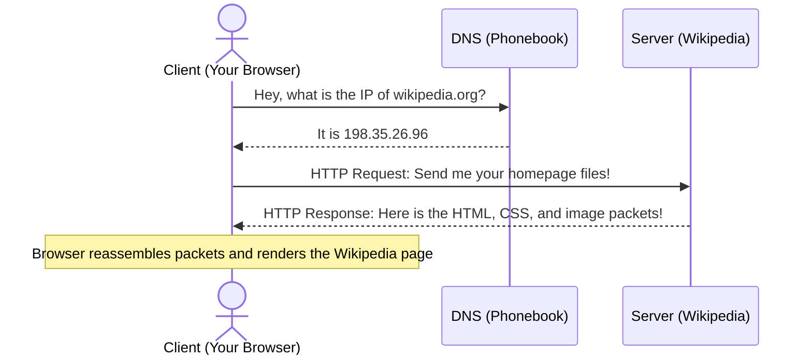

# How the Internet Works: A Beginner's Guide

To understand web development, you don't need to know all the complex physics of cables and routers. Instead, think of the internet as a massive system for **sending and receiving letters** (or orders).

Let's break down the core components of how information moves across the web.

---

## 🍽️ The Restaurant Analogy

The easiest way to understand the internet is to imagine you are eating at a restaurant:

1. **The Client (You, the Diner):** You sit at a table wanting to eat. You are the consumer of the food.
2. **The Server (The Kitchen):** The kitchen has the ingredients, chef, and recipes. They prepare the food.
3. **The Request (Your Order):** You look at the menu and tell the waiter what you want (e.g., *"I would like the spaghetti, please"*).
4. **The Response (The Meal):** The kitchen prepares your order, and the waiter brings the plate of spaghetti to your table.

In internet terms, this is exactly what happens when you visit a website like Google or YouTube:
- Your web browser (Chrome, Safari, etc.) is the **Client**.
- The computer hosting the website's files is the **Server**.
- Typing in a web address and hitting Enter sends a **Request**.
- The server processing that request and sending back the website files (HTML, images) is the **Response**.

---

## 🗝️ Core Terms Explained (No Jargon Left Behind)

To make this work, computers use a few fundamental systems:

### 1. Client vs. Server
*   **Client:** Any device or application (like your computer, phone, or web browser) that asks for information.
*   **Server:** A powerful computer located somewhere in the world that sits waiting to "serve" information to clients when asked. Servers are designed to be running 24/7 without turning off.

### 2. IP Addresses (The Mailing Address)
Every device connected to the internet has a unique number assigned to it called an **IP Address** (e.g., `172.217.7.14` for Google). Think of this as the physical mailing address of your home. To send a letter, you need to know exactly where it's going.

### 3. DNS: Domain Name System (The Phonebook)
Computers love numbers, but humans love words. It's much easier to remember `google.com` than `172.217.7.14`. 
The **DNS** is the internet's phonebook. When you type `google.com` into Chrome:
1. Your client asks the DNS: *"What is the IP address for google.com?"*
2. The DNS replies: *"It is 172.217.7.14."*
3. Your client then uses that number to send the request directly to Google's server.

### 4. Packets (The Envelopes)
When you request a large image or video, the server doesn't send it in one giant block. Instead, it chops the file into thousands of tiny pieces called **Packets**. 
Imagine taking a Lego castle apart, putting each block in its own envelope, mailing them separately, and then rebuilding the castle at the destination. The internet sends data in these small packets, and your browser pieces them back together automatically.

---

## 📝 A Real-World Example

Here is the exact sequence of what happens when you type `https://wikipedia.org` and press **Enter**:

1. **Step 1:** Your browser asks the DNS server to translate `wikipedia.org` into an IP address.
2. **Step 2:** The DNS sends back `198.35.26.96`.
3. **Step 3:** Your browser sends a **request** to `198.35.26.96` saying, *"Show me your home page."*
4. **Step 4:** The Wikipedia server receives the request, processes it, and sends back a **response** containing the website's files (HTML code, images, styling sheets) as packets.
5. **Step 5:** Your browser reads those files and draws the Wikipedia page on your screen.
