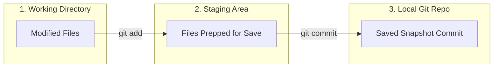

# Git and GitHub Basics: Version Control for Beginners

When writing code, you will make mistakes. You might delete a file by accident, or write a bug that crashes your entire program, and wish you could "undo" everything back to when it worked.

**Git** is your safety net. It is a tool that tracks history and changes in your code. 

**GitHub** is a cloud hosting service that stores those backups online so you can share your code and collaborate with others.

---

## 💾 Core Concept: What is a Repository (Repo)?

A **Repository** (often shortened to **Repo**) is simply a folder that Git is tracking. 

Normally, folders on your computer just save the current version of your files. When you turn a folder into a Git Repository, Git starts secretly taking snapshots of your folder every time you ask it to. You can travel back in time to any previous snapshot whenever you want.

---

## 🛠️ The Git Workflow (The 3 Stages)

To save your work in Git, you follow a simple three-step cycle:



1.  **Working Directory:** You modify, create, or delete code files. Git notices these files are changed but hasn't saved them yet.
2.  **Staging Area (Staging):** You select *which* files you want to include in your next save snapshot using `git add`. Think of this as loading items into a moving box before taping it shut.
3.  **Repository (Commit):** You officially save the snapshot using `git commit`. Think of this as taping the moving box shut and labeling it with a note (e.g., *"Added login page styling"*).

---

## 🗃️ The 5 Commands You Must Know

Here are the commands you'll use daily:

### 1. `git init` (Initialize)
*   **What it does:** Turns your current directory into a Git repository.
*   **When to run it:** Only once at the very start of a new project.
*   **Example:** `git init`

### 2. `git status` (Check Status)
*   **What it does:** Shows you which files have been modified, which are staged to be saved, and which files Git is ignoring.
*   **Example:** `git status` (Run this frequently to see where you are).

### 3. `git add` (Stage Files)
*   **What it does:** Moves files from your Working Directory to the Staging Area.
*   **Examples:**
    *   `git add index.html` (Stages just the `index.html` file)
    *   `git add .` (Stages **all** modified files in the folder)

### 4. `git commit -m "your message"` (Commit Changes)
*   **What it does:** Takes the snapshot of all staged files and saves it permanently to the repository history.
*   **Why the `-m`?** It stands for "message". You must write a short note describing what you changed.
*   **Example:** `git commit -m "Create landing page navigation menu"`

### 5. `git push` (Upload to Cloud)
*   **What it does:** Uploads your local Git history snapshots to your online GitHub repository.
*   **Example:** `git push origin main`

---

## 📝 A Live Git Workflow Example

Let's walk through initializing a project, saving a file, and pushing it to GitHub:

```bash
# Step 1: Open your project folder
$ cd my-website

# Step 2: Initialize Git (Make this a tracked repo)
$ git init
Initialized empty Git repository in /Users/raviranjan/my-website/.git/

# Step 3: Create a file and check status
# (Suppose you create index.html with some text)
$ git status
Untracked files:
  (use "git add <file>..." to include in what will be committed)
	index.html

# Step 4: Stage the file for saving
$ git add index.html

# Step 5: Save the snapshot with a commit message
$ git commit -m "Initial commit: create index.html page"
[main (root-commit) b79f321] Initial commit: create index.html page
 1 file changed, 1 insertion(+)
 create mode 100644 index.html

# Step 6: Link to your GitHub repository (GitHub gives you this command)
$ git remote add origin https://github.com/your-username/my-website.git

# Step 7: Push your local saves up to GitHub
$ git push -u origin main
Branch 'main' set up to track remote branch 'main' from 'origin'.
Everything up-to-date
```
