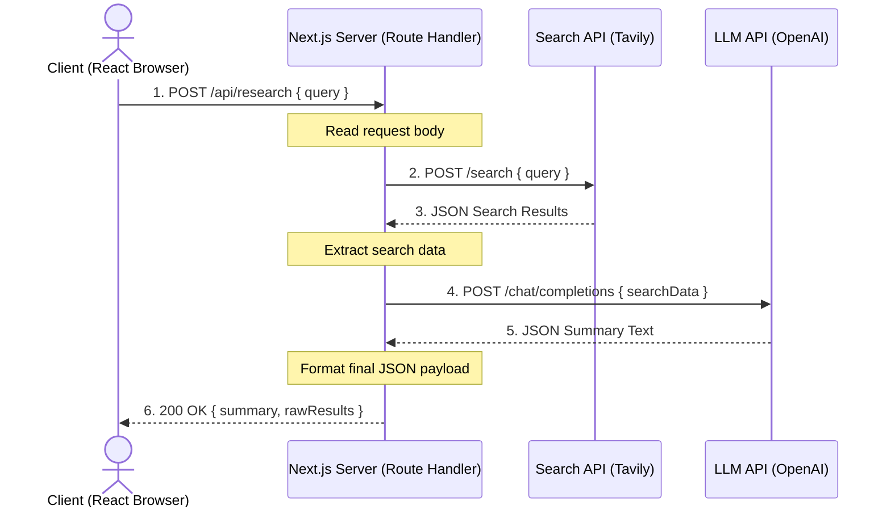

# The Request/Response Cycle: Orchestrating API Flows

When building AI web applications, the **Request/Response Cycle** represents the lifespan of a user action. 

In this guide, you will learn how Node.js (running inside Next.js Route Handlers) receives a client request, acts as an intermediary to fetch data from search and LLM engines, and returns a compiled response back to the client.

---

## 🔄 The Multi-Step Cycle

When a user types a query (e.g. *"Summarize today's space news"*) and clicks "Submit" on a React interface, it initiates a chain reaction:



### The 6 Stages of the Cycle:
1.  **Request Initiated (Client → Server):** The React frontend sends an HTTP `POST` request to our Next.js backend endpoint `/api/research` carrying the query inside the JSON body.
2.  **Server Receives and Parses:** Node.js catches the request. It parses the body stream (`await request.json()`) to retrieve the user's query.
3.  **Search Fetch (Server → External API):** The server makes a outbound `fetch` call to a search engine like Tavily to retrieve current live documents matching the query.
4.  **LLM Fetch (Server → LLM Provider):** Once search results return, the server constructs a prompt combining the original query and the search data, and makes another `fetch` call to an LLM provider like OpenAI.
5.  **Compile & Wrap:** The server extracts the generated text response from the LLM JSON data.
6.  **Response Dispatched (Server → Client):** The server finishes by sending a `200 OK` JSON response containing the final summary text and the raw citations, closing the connection.

---

## 💻 Code Example: The Full Cycle Implementation

Here is a complete Next.js Route Handler demonstrating this exact cycle.

Place this inside `app/api/research/route.ts`:

```typescript
import { NextResponse } from "next/server";

export async function POST(request: Request) {
  // --- STAGE 2: Receive & Parse ---
  try {
    const { query } = await request.json();

    if (!query) {
      return NextResponse.json({ error: "Missing query" }, { status: 400 });
    }

    // --- STAGE 3: Call Search API ---
    const searchResponse = await fetch("https://api.tavily.com/search", {
      method: "POST",
      headers: { "Content-Type": "application/json" },
      body: JSON.stringify({
        api_key: process.env.TAVILY_API_KEY || "mock",
        query
      })
    });

    if (!searchResponse.ok) {
      return NextResponse.json({ error: "Search failed" }, { status: 502 });
    }
    const searchData = await searchResponse.json();

    // --- STAGE 4: Call LLM API ---
    const llmResponse = await fetch("https://api.openai.com/v1/chat/completions", {
      method: "POST",
      headers: {
        "Content-Type": "application/json",
        "Authorization": `Bearer ${process.env.OPENAI_API_KEY || "mock"}`
      },
      body: JSON.stringify({
        model: "gpt-4o-mini",
        messages: [
          { role: "system", content: "Summarize the search findings." },
          { role: "user", content: JSON.stringify(searchData) }
        ]
      })
    });

    if (!llmResponse.ok) {
      return NextResponse.json({ error: "LLM synthesis failed" }, { status: 502 });
    }
    const llmData = await llmResponse.json();
    const summary = llmData.choices[0].message.content;

    // --- STAGE 5 & 6: Compile & Respond ---
    return NextResponse.json({
      query,
      summary,
      results: searchData.results || []
    }, { status: 200 });

  } catch (error: any) {
    console.error("Cycle error:", error);
    return NextResponse.json({ error: "Internal crash", details: error.message }, { status: 500 });
  }
}
```

---

## ⚠️ Common Mistake: Forgetting to Return the Response Object

In Next.js Route Handlers, if you write code that processes everything but forget to return the `NextResponse` object from the function, the client will hang indefinitely waiting for the server to close the connection.

```typescript
export async function POST(request: Request) {
  const { query } = await request.json();
  const summary = "Done!";

  // OOPS: Prepared the response, but didn't return it!
  NextResponse.json({ summary }); 
}
```
*   **What happens:** The API hangs, eventually causing a gateway timeout (`504 Gateway Timeout`) or leaving the browser spinner loading forever.
*   **The Fix:** Always make sure the `NextResponse.json(...)` call is prefixed with the `return` keyword: `return NextResponse.json({ summary });`.

---

## 🧠 Self-Check Recall

1.  During a request/response cycle, does the client interface talk directly to OpenAI, or does it talk to our Next.js server first?
2.  What HTTP status code should be returned if the user fails to provide a required input parameter in the request body?
3.  Why do we return a `502 Bad Gateway` status code if the external search API fails to respond?
4.  Write the single line of code used to parse the incoming JSON payload from a Next.js `Request` object.
5.  What occurs on the client side if the server processes the data correctly but fails to send back a response?

<details>
<summary>🔑 Click to reveal answers</summary>

1.  **It talks to our Next.js server first.** Our server acts as the secure middleman to protect secret API keys.
2.  **`400 Bad Request`**
3.  **To indicate that our code did not crash**, but an upstream service (Tavily) that we depend on failed to respond properly.
4.  **`const body = await request.json();`**
5.  **The client hangs indefinitely** until the connection times out (e.g. throwing a 504 Gateway Timeout or browser network error).
</details>
