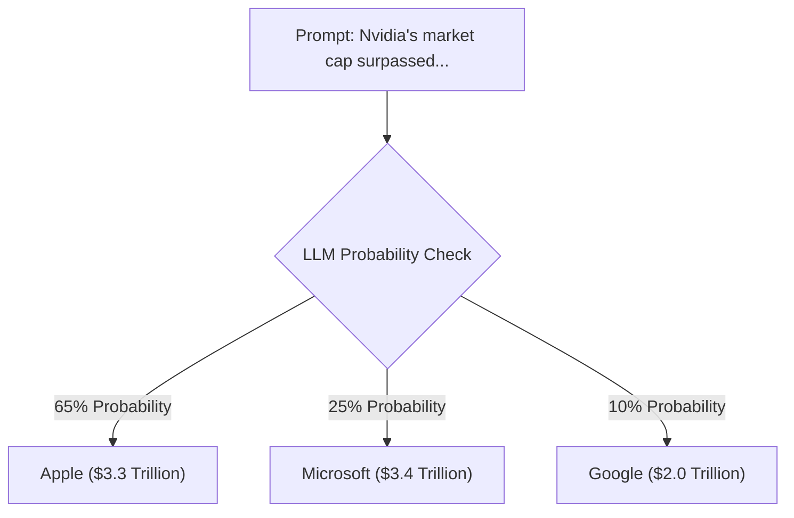

# How LLMs Work: The Next-Word Predictor

To build reliable AI applications, you must peel back the magic and understand what an LLM (Large Language Model) actually does under the hood.

---

## 🔍 1. Plain-English Explanation (Zero ML Required)

An LLM is not an active human brain, a database, or a truth-checking calculator. Instead, think of it as an incredibly advanced version of **autocomplete** on your smartphone.

When you type *"I am going to the..."* on your phone, it suggests *"store"*, *"beach"*, or *"park"*. It does this because it has scanned millions of text messages and learned which words standardly follow that sequence.

An LLM does the exact same thing but at a massive scale. It is trained on billions of pages of internet text. When you give it a prompt, it reads your text and calculates the mathematical probability of what the **next word** should be. It outputs that word, adds it to the sequence, and predicts the next one. It repeats this loop until it reaches a stopping point.

---

## 💼 2. Why It Matters for an Investment Agent

Because LLMs are probability calculators rather than calculators of facts, they have no built-in concept of "truth". 

If you ask an LLM, *"What was Apple's net income in Q3 2024?"*, it doesn't query a live database. It simply outputs a number that *sounds* like a realistic financial figure based on its training patterns. In finance, being 1% off can lead to catastrophic losses. 

Understanding that the LLM is simply trying to write text that *sounds plausible* helps us realize why we must force the LLM to read real financial files or search queries first rather than relying on its internal memory.

---

## 📝 3. Concrete Example

Imagine we ask a standalone LLM to complete this financial sentence:

> **Prompt:** *"In 2024, Nvidia's market capitalization surpassed..."*

The LLM does not check the stock market. It looks at the probability distribution of words matching that statement in its training data:
- *"Apple"* might have a 65% probability score.
- *"Microsoft"* might have a 25% probability score.

If it picks *"Apple"*, it outputs that text because it is the most statistically likely continuation, even if Microsoft actually had a higher market cap at that exact microsecond in the real world.

---

## 🧠 Self-Check Recall

1.  Is an LLM more like a database search engine, a calculator, or a high-powered autocomplete system?
2.  How does an LLM decide what word to write next in its response?
3.  Why is a standalone LLM dangerous for checking precise numerical financial metrics?
4.  Does an LLM "know" if a statement it generates is factually true or false?
5.  What is the technical term for the model's output generation segments (words or pieces of words)?

🔑 Click to reveal answers

1.  **An autocomplete system.** It predicts sequences based on probabilities rather than looking up data.
2.  **By calculating which word has the highest probability** of following the previous sequence of words.
3.  **Because it prioritizes plausibility over truth.** It will generate numbers that sound correct based on language patterns, even if they are completely fabricated (hallucinations).
4.  **No.** It only knows the mathematical probability of word arrangements, not the real-world truth of those arrangements.
5.  **Tokens.**

