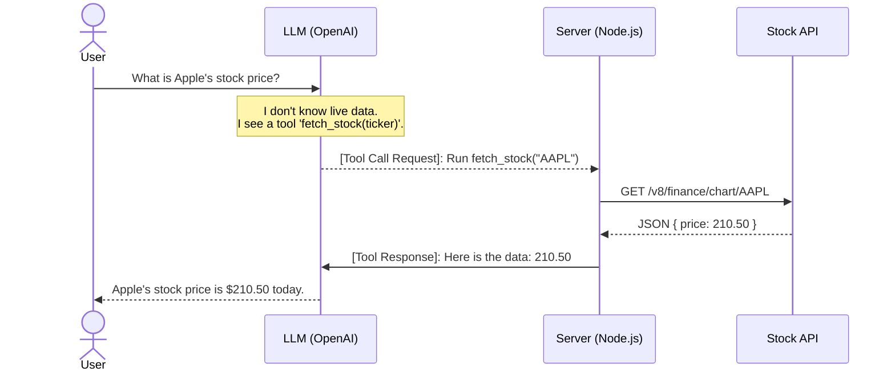

# Function & Tool Calling: Giving LLMs Hands

By default, an LLM is like a person locked in a room with no internet connection. They can write essays, but they cannot look at the weather, search Google, or check current stock prices. 

**Tool Calling** is the mechanism that gives LLMs "hands" to interact with the outside world.

---

## 🔍 1. Plain-English Explanation (Zero ML Required)

A common misconception is that the LLM *runs* the code to search the web or fetch database tables. This is **incorrect**.

Instead, Tool Calling is a **two-step coordination game**:
1.  **The LLM chooses the tool:** You tell the LLM: *"I have a tool called `fetchStockPrice(ticker)`. Here is how you use it."* When the user asks, *"How is Tesla doing today?"*, the LLM realizes it doesn't know the live price. It responds not with an answer, but with a request: *"Please run `fetchStockPrice("TSLA")` for me."*
2.  **Our server runs the tool:** Our Node.js backend reads this request, runs the actual API query to get the stock price (e.g., `$220.50`), and sends that value *back* to the LLM. The LLM reads the price and writes a natural response: *"Tesla is trading at $220.50 today."*

---

## 💼 2. Why It Matters for an Investment Agent

An investment agent is useless if it cannot access live data. Financial reports are released hourly, and stock prices change every millisecond.

By defining tools like `googleSearch` or `fetchCompanyBalanceSheet`, the agent can act autonomously. If a user asks, *"Is Company X a safe investment?"*, the LLM can:
- Call a search tool to check for recent lawsuits or product recalls.
- Call a financial tool to fetch the current Debt-to-Equity ratio.
- Synthesize these tool inputs to form a balanced evaluation.

---

## 📝 3. Concrete Example

Here is how the tool-calling flow executes under the hood:

1.  **User asks:** *"What is Apple's stock price?"*
2.  **LLM responds:** *"I want to call the tool `fetch_stock` with the parameter `{"ticker": "AAPL"}`."*
3.  **Our Server:** Catches this instruction, performs a fetch request to a financial API, and retrieves `$210.50`.
4.  **Our Server sends back:** *"The tool returned `210.50`."*
5.  **LLM responds:** *"Apple is trading at $210.50 today."*

---

## 🧠 Self-Check Recall

1.  Does the LLM execute code directly to search the web or fetch stock data when it calls a tool?
2.  Which part of the system runs the actual tool code (the LLM API or our Node.js server)?
3.  What format does the LLM use to specify which tool it wants to call and what parameters to pass?
4.  How does the LLM know what tools are available for it to request?
5.  Why is tool calling essential for an agent analyzing corporate financials?

🔑 Click to reveal answers

1.  **No.** The LLM only outputs a JSON instruction requesting a tool call. It cannot execute code or access networks itself.
2.  **Our Node.js server.** Our backend reads the LLM's request, executes the code, and passes the output back to the LLM.
3.  **JSON.** (e.g. `{ "name": "fetch_stock", "arguments": { "ticker": "AAPL" } }`).
4.  **We define them in the API request.** When we call the LLM, we pass a list of tool descriptions (schemas) alongside the prompt.
5.  **Because financial data changes constantly.** Without tools, the model is trapped inside its static training data and cannot access current stock prices or news.

