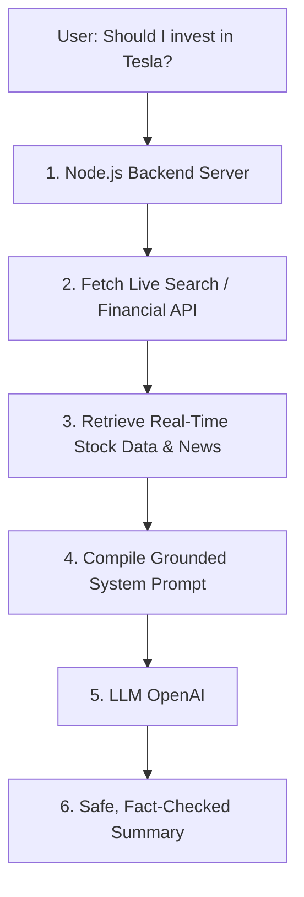

# Grounding & RAG: Preventing Hallucinations

In an AI interview, the single most critical concept you must defend is the **architecture** of your application. You must explain *why* you didn't just write a simple chat box that forwards the user's question directly to OpenAI, and *how* your design ensures financial safety.

This guide details **Hallucinations**, **Grounding**, and **RAG** (Retrieval-Augmented Generation)—the core pillars of a trustworthy investment agent.

---

## 1. The Core Problem: Standalone LLM Queries (No Tools)

Suppose we build a simple app that takes the user's query and sends it directly to a raw LLM:

```text
User Question: "Should I invest in Tesla stock today?"
                  │
                  ▼
         [ Raw OpenAI API ] 
                  │
                  ▼
  AI Answer: "Yes, Tesla's new Cybertruck is selling well..."
```

This architecture is **highly dangerous and unreliable** for three reasons:

### A. The Knowledge Cutoff
LLMs are trained once. The moment training completes, their memory is frozen in time (their "Knowledge Cutoff"). If an LLM was trained in October 2024, it has no idea if Tesla stock crashed yesterday, if Elon Musk stepped down, or if the company reported record losses this morning. It is essentially blind to the present.

### B. Confident Hallucinations
As learned in File 01, LLMs are probability engines. If you ask them for a stock price or revenue figures from 2026, they will not say, *"I don't know."* Instead, they will generate numbers that look mathematically correct. They will confidently invent cash flows, revenue margins, and market trends. In machine learning, this fabrication is called a **Hallucination**.

### C. Bias and Speculation
Raw models are trained on internet forums, opinion pieces, and speculative articles. Left to themselves, they will repeat biases and hype, rather than analyzing raw, uncolored corporate financials.

---

## 2. The Solution: Grounding & RAG

To make the model safe, we must shift its role. We stop asking it to **remember facts**, and instead ask it to **analyze documents we provide**. This pattern is called **Retrieval-Augmented Generation (RAG)**.



### The RAG Process:
1.  **Retrieve:** When the user queries Tesla, our backend server intercepts the call and runs a real-time web search (using Tavily or Yahoo Finance APIs) to get the latest 10-K filings, earnings news, and stock prices.
2.  **Augment (Grounding):** We take that fresh text data and paste it directly into the LLM's prompt. We instruct the model: *"You are an editor. Answer the query using **ONLY** the provided text below. If the answer is not in the text, say 'Not found'."*
3.  **Generate:** The LLM reads the text, extracts the figures, and writes a summary. 

This is called **Grounding**. The LLM's response is anchored (grounded) to real-world, verified facts. It is forbidden from using its internal memory to speculate.

---

## 3. Concrete Comparison: Standalone vs. Grounded (RAG)

Let's look at the difference in performance:

| Feature | Standalone Query (No RAG) | Search-Grounded Query (With RAG) |
| :--- | :--- | :--- |
| **Data Source** | Model's static training memory. | Live APIs and search databases. |
| **Currentness** | Outdated (stuck at knowledge cutoff). | Real-time (current to the millisecond). |
| **Numeric Accuracy**| Fabricated / guessed numbers. | Exact, verified figures extracted from text. |
| **Response Style** | *"I think Tesla is a good buy because of its brand name..."* | *"According to the press release from July 2026, revenue rose 4%..."* |

---

## ⚠️ Common Mistake: Mixing Up "Search Results" with "Direct Answers"

A common architectural flaw is sending search queries to the web, getting the results, and displaying them directly to the user without filtering, or asking the LLM to write a summary *before* the search results arrive.

```typescript
// INCORRECT: Summarizing before search completes!
const summary = await callLLM("Should I invest in X?");
const searchData = await callSearchAPI("X news");
```
*   **What happens:** The user receives a hallucinated summary, and then a list of links below it. The AI summary is still untrustworthy.
*   **The Fix:** You must await the search API results *first*, format those results into a string, and pass that string inside the LLM call payload:
```typescript
// CORRECT: Fetch first, inject data, then let the LLM analyze it
const searchData = await callSearchAPI("Tesla earnings 2026");
const summary = await callLLMWithData(query, searchData);
```

---

## 🧠 Self-Check Recall

1.  What does the term "Knowledge Cutoff" mean for an LLM?
2.  What is the technical term for when an LLM confidently fabricates facts or figures?
3.  In RAG, what does the "Retrieval" stage accomplish?
4.  Why does grounding the model with real-time text prevent it from hallucinating stock prices?
5.  What instructions should be placed in the System Prompt to enforce grounding?

<details>
<summary>🔑 Click to reveal answers</summary>

1.  **The date when the model's training data was frozen.** The model has no knowledge of real-world events that occurred after this date.
2.  **Hallucination.**
3.  **It fetches live data from external sources** (like search APIs or database tables) matching the user's query.
4.  **It restricts the model to extracting facts.** The model is instructed to only read and summarize the provided text, rather than predicting numbers from its probability memory.
5.  **Commands like:** *"Use ONLY the provided context to answer the question"*, *"If the answer is not present in the context, state that you do not know"*, and *"Do not make assumptions or extrapolate beyond the text."*
</details>
