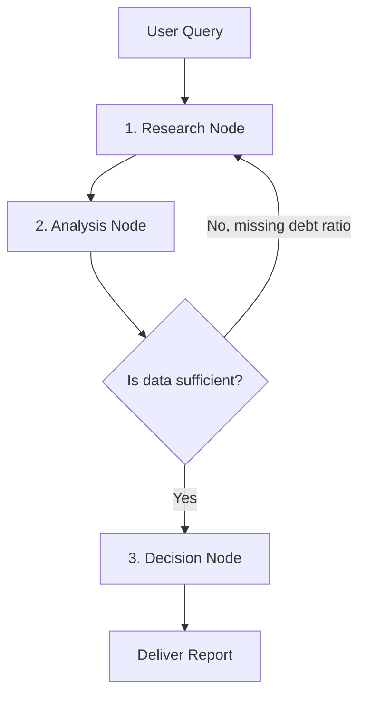

# Agents vs. Chains: The Power of Loops

When building applications with Large Language Models, developers start with either a **Chain** architecture or an **Agent** architecture. 

In this guide, you will learn the differences between them and why building a secure investment assistant requires moving from simple chains to the cyclic graph model of **LangGraph.js**.

---

## 🔍 1. Plain-English Explanation (Zero ML Required)

*   **Chains (Linear execution):** Think of a chain as an **assembly line** in a factory. Product parts move down the line in one direction: Step A (Assembly) → Step B (Painting) → Step C (Packaging). If the painter makes a mistake in Step B, there is no way to send the product backward; it is packed as-is.
*   **Agents (Looping execution):** Think of an agent as a **craftsman** working in a workshop. The craftsman looks at the customer's request, makes a draft, evaluates it, decides they need a different tool, searches for a reference, revises the draft, checks it again, and only delivers the product when they are satisfied. They can repeat steps, backtrack, and loop dynamically based on intermediate results.

In code, **Chains** are simple sequential pipelines (`fetch -> LLM -> display`). **Agents** are state machines that can execute loops (`fetch -> LLM -> check results -> fetch more -> LLM -> output`).

---

## 💼 2. Why It Matters for an Investment Agent

An investment analysis is complex. If you ask a linear chain, *"Is company X a good investment?"*, it runs a single search query, feeds the output to the LLM, and prints the result. 

If the search query returns page errors or irrelevant news, the chain has no way to correct itself. It must give a bad answer based on bad data.

An **Agent** can self-correct:
1.  It searches for *"Company X stock details"*.
2.  The LLM reads the result and notices: *"The articles don't list the current Debt-to-Equity ratio. I need that to make an analysis."*
3.  Because it can loop, the agent calls a different financial API tool to fetch the balance sheet.
4.  It compiles the complete data and outputs a verified investment summary.

---

## 📝 3. Concrete Example

Here is a visual contrast of the two architectures:

### The Linear Chain (Fragile)
```text
[User Query] ──> [Run Search] ──> [Call LLM] ──> [Final Answer]
```
*If "Run Search" returns a server error, the LLM receives empty text and hallucinating occurs.*

### The Agentic Graph (Resilient)

*The agent can loop between Research and Analysis as many times as necessary to fetch missing data before routing to Decision.*

---

## 🧠 Self-Check Recall

1.  What is the main structural difference between a Chain and an Agent?
2.  Why does a linear chain fail if an intermediate API call returns incomplete data?
3.  In LangGraph.js, what is the term used to represent the different actions (like Research or Decision) in a workflow?
4.  How does an agentic loop handle missing information dynamically compared to a chain?
5.  What keyword describes a system that can run loops and cycle back to previous states (Cyclic or Acyclic)?

<details>
<summary>🔑 Click to reveal answers</summary>

1.  **Chains are linear** (move only forward). **Agents are cyclic** (can execute loops, backtrack, and choose tools dynamically).
2.  **It cannot backtrack.** It must pass whatever data is retrieved to the next step, leading to poor output or hallucinations.
3.  **Nodes.**
4.  **It evaluates the output,** identifies what is missing, and loops back to call tools to fetch the required data.
5.  **Cyclic.**
</details>
