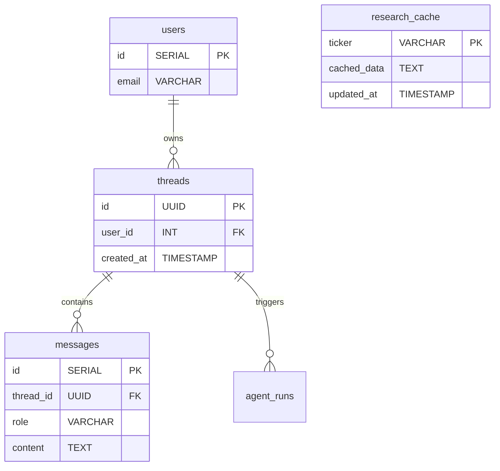

# Database Integration for the Investment Agent

If we extend our mockup financial assistant into a production-grade application, we must integrate a database. 

This guide details three key features a database (like PostgreSQL) enables, along with a schema design tailored specifically for this project.

---

## 1. Core Use Cases for a Database

### A. RAG Caching (Cost & Speed Optimization)
Web search APIs (Tavily) and LLMs (OpenAI) charge per request/token. If 100 users ask for analysis on "Tesla stock" in the same hour, calling the API 100 times is a waste of money and slow. 
*   **The Solution:** Save the search results in a `research_cache` table. Before running a search, check the database: if we have cached results for that ticker that are less than 12 hours old, retrieve them from our database instead, bypassing the API.

### B. Agent Run Logging (Evaluation & Debugging)
To debug why an agent made a bad recommendation, we need to trace what it did.
*   **The Solution:** Log every step of the LangGraph execution (which nodes ran, the exact inputs, and the outputs) to an `agent_runs` table for auditing and analysis.

### C. Conversation Thread Storage (User Session Memory)
To support multi-turn chat sessions where users can log back in and see past threads, we cannot store messages in server memory.
*   **The Solution:** Store user chat histories in `threads` and `messages` tables.

---

## 2. Example Database Schema

Here is a relational schema layout to support these features:



### SQL Definition:
```sql
-- 1. Cache table to optimize search costs
CREATE TABLE research_cache (
  ticker VARCHAR(10) PRIMARY KEY,
  cached_data TEXT NOT NULL,
  updated_at TIMESTAMP DEFAULT CURRENT_TIMESTAMP
);

-- 2. Threads table for user chat sessions
CREATE TABLE threads (
  id UUID PRIMARY KEY,
  user_id INT NOT NULL,
  created_at TIMESTAMP DEFAULT CURRENT_TIMESTAMP
);

-- 3. Messages table containing individual turns
CREATE TABLE messages (
  id SERIAL PRIMARY KEY,
  thread_id UUID REFERENCES threads(id) ON DELETE CASCADE,
  role VARCHAR(20) NOT NULL, -- 'user', 'assistant'
  content TEXT NOT NULL,
  created_at TIMESTAMP DEFAULT CURRENT_TIMESTAMP
);
```

---

## ⚠️ Common Mistake: Storing Unstructured JSON as Plain Text

When caching financial metrics returned as JSON objects, beginners often store them in a standard text column (`VARCHAR` or `TEXT`) without structure.

```sql
-- INCORRECT: Plain text JSON storage
CREATE TABLE cache (
  ticker VARCHAR(10),
  data TEXT -- Stored as raw string
);
```
*   **Why it's bad:** If you want to run a SQL query to find all cached companies with a P/E ratio less than 20, you cannot do it because the database treats the entire JSON object as a flat string.
*   **The Fix:** In PostgreSQL, always store structured JSON data in a **`JSONB`** column type, which allows indexing and querying individual keys directly in SQL:
```sql
-- CORRECT: JSONB data type
CREATE TABLE cache (
  ticker VARCHAR(10) PRIMARY KEY,
  data JSONB NOT NULL
);

-- Querying directly:
SELECT ticker FROM cache WHERE (data->>'peRatio')::numeric < 20;
```

---

## 🧠 Self-Check Recall

1.  How does a database cache help reduce API token costs in a RAG pipeline?
2.  What database column type should you use in PostgreSQL to store and query JSON data?
3.  Why is it important to log the inputs and outputs of every agent node execution?
4.  Write the relationship mapping between users, threads, and messages in terms of one-to-many linkages.
5.  What SQL data type is best for storing exact timestamps of when a cache entry was last updated?

<details>
<summary>🔑 Click to reveal answers</summary>

1.  **By avoiding repeat API requests.** It serves cached data for identical queries rather than executing new calls to Tavily or OpenAI.
2.  **`JSONB`** (Binary JSON).
3.  **For debugging and evaluation.** It allows developers to trace agent behavior and identify exactly which node failed or hallucinated.
4.  **One User** has many **Threads**. **One Thread** has many **Messages**.
5.  **`TIMESTAMP`** (or `TIMESTAMPTZ` for timezone support).
</details>
