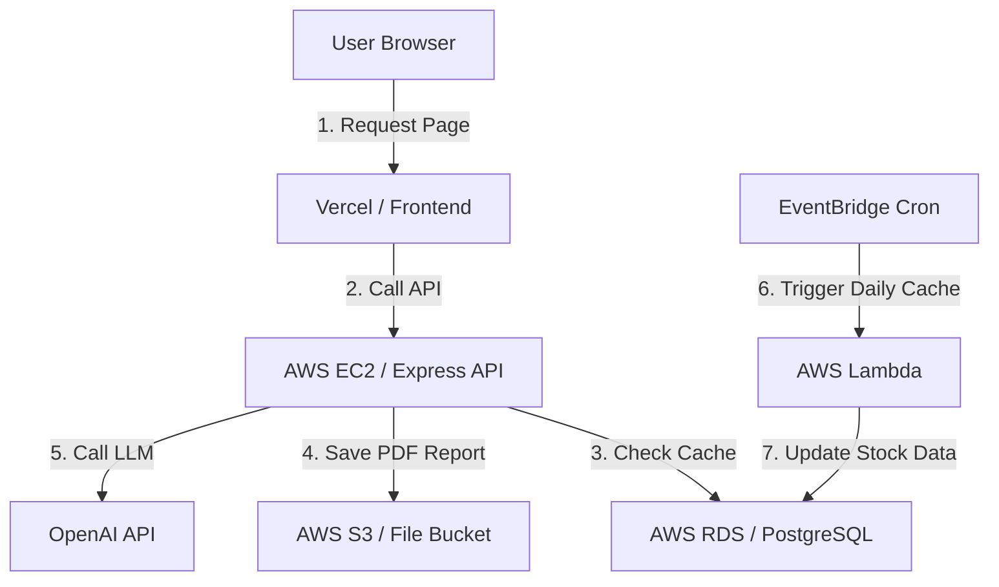

# AWS in an AI Product Context: Altuni AI Labs

In an interview for an AI engineering role, you should be able to explain how a real company (like Altuni AI Labs) would leverage AWS to host and scale a decision-support application.

Here is a typical production architecture for our investment agent:

---

## 1. Hosting the Backend (EC2 or ECS)
While Vercel is excellent for hosting the Next.js frontend pages, running long-running LangGraph agent cycles or HTML scrapers in Vercel Serverless Functions can exceed the 15-second execution timeout limits. 
*   **The Design:** Altuni AI Labs would host the Express.js or Next.js backend API on **Amazon EC2** or a container hosting service (ECS), ensuring the agent has unlimited execution time.

## 2. Storing Financial PDFs (S3)
When our agent compiles a detailed company valuation report, we convert the result into a clean PDF.
*   **The Design:** We upload the PDF to **Amazon S3** and save the S3 file URL inside our PostgreSQL database, serving the URL link to the client interface.

## 3. Background Data Refreshing (Lambda + Cron)
To ensure the stock price cache table in PostgreSQL is updated before the stock market opens, we need to run a query job every morning at 8:00 AM.
*   **The Design:** We write a lightweight Python/Node script, upload it as an **AWS Lambda** function, and use Amazon EventBridge (a cloud cron utility) to trigger the function once a day, minimizing idle server billing.

---

## 🧠 Self-Check Recall
1.  Why is hosting a long-running AI agent on a standard serverless frontend provider like Vercel risky?
2.  How do S3 and RDS work together when managing generated PDF reports?
3.  What cloud service can trigger a Lambda function on a scheduled timer?
4.  Draw or explain the path of data when a user requests a historical PDF report.
5.  What is the advantage of using a dedicated virtual server (EC2) for running agent graph loops?

🔑 Click to reveal answers

1.  **Because of timeout limits.** Serverless functions on frontend hosting services usually have short limits (such as 15 seconds) which long-running search and LLM loops can exceed.
2.  **S3 stores the physical PDF file** and returns a URL. **RDS stores that URL** inside the database table row linked to the user.
3.  **Amazon EventBridge** (or CloudWatch Events).
4.  **User requests report** -> **API server queries RDS** to find the file URL -> **RDS returns URL** -> **API redirects User** to download the PDF from S3.
5.  **No execution timeout limits.** The script can execute multi-turn loops and HTML processing tasks indefinitely.

